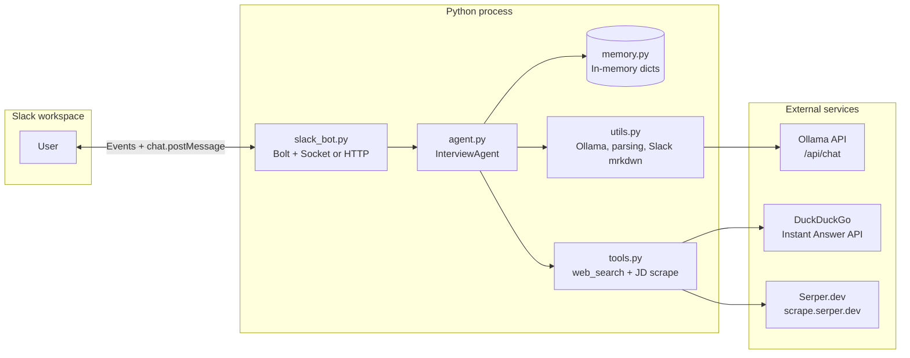
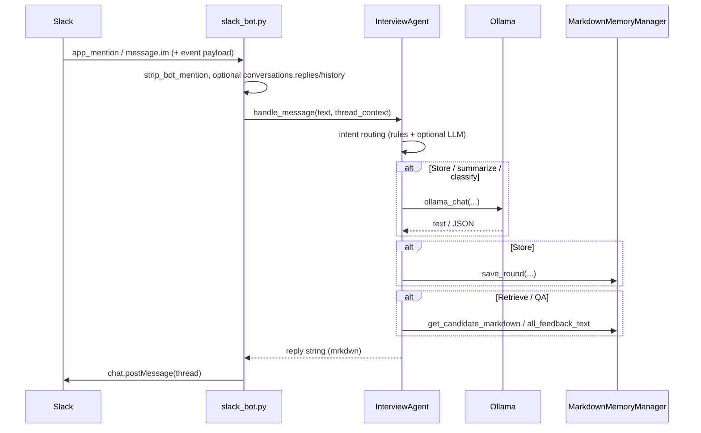
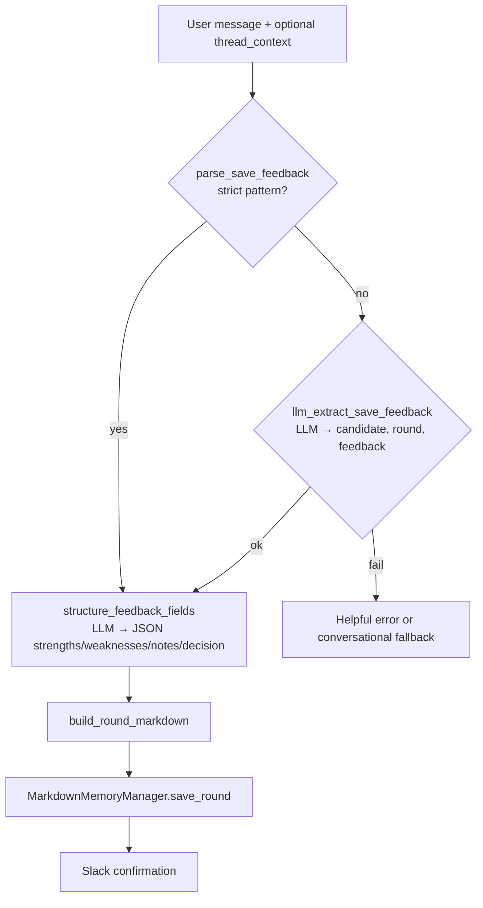
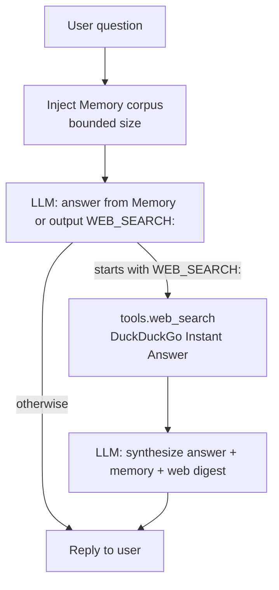

# Interview Feedback Agent

A Slack bot that helps recruiters and interviewers **store**, **retrieve**, and **summarize** interview feedback using an LLM (Ollama local or [Ollama Cloud](https://ollama.com)), with optional **web search** when memory is not enough.

---

## High-level architecture



- **Entry point:** `slack_bot.py` receives Slack events and calls `InterviewAgent.handle_message(text, thread_context)`.
- **Brain:** `agent.py` routes by **intent**, calls the LLM via `utils.ollama_chat` where needed, and reads/writes **in-process memory** in `memory.py`.
- **Tools:** `tools.web_search` is only used from the **question** path when the model asks for it. `tools.scrape_jd_via_serper` is used for the **JD verdict** flow.

There is **no separate HTTP API** exposed by this repo for clients; the only “API surface” in production is **Slack** (unless you import `InterviewAgent` from another script).

---

## Runtime modes (Slack delivery)

| Mode | Env | How events arrive |
|------|-----|-------------------|
| **Socket Mode** (default for local dev) | `SLACK_APP_TOKEN` (`xapp-…`) | WebSocket to Slack; no public URL. |
| **HTTP / Events API** | No app token; `SLACK_SIGNING_SECRET` + `PORT` | Bolt listens on `http://host:PORT/slack/events`; Slack POSTs to a **public HTTPS** URL (e.g. ngrok). |

Both paths deliver the same event payloads to Bolt; your handlers do not change.

---

## Request flow (Slack → reply)



1. **Inbound:** Bolt listens for `app_mention` (channels where the bot is invited) and `message` in DMs (`message.im` subscription).
2. **Context:** For “record this” style saves, `slack_bot` loads **thread replies** or **recent channel history** and passes it as `thread_context`.
3. **Outbound:** The reply is sent with `chat.postMessage` in the same thread / DM, `mrkdwn=True`, with optional length truncation (~39k chars).

---

## Intent routing (`agent.py`)

`handle_message` runs in this **order**:

1. **Conversational shortcut** — thanks, short acknowledgments, hello/bye (`utils.is_gratitude_or_light_chat`) → friendly reply, **no** save/retrieve.
2. **Intent classification**
   - **Heuristics** (`utils.heuristic_intent_label`): e.g. `save feedback …`, `record this`, `get feedback …`, `summarize …`.
   - If still ambiguous → **LLM** (`IntentClassifier`) returns one of:
     `STORE_FEEDBACK`, `UPDATE_FEEDBACK`, `APPEND_FEEDBACK`, `JD_VERDICT`, `RETRIEVE_FEEDBACK`, `SUMMARIZE`, `CLEAR_MEMORY`, `QUESTION`, `HELP`.
3. Dispatch to the matching handler.

---

## Saving feedback



- **Strict form:** `save feedback <Candidate> <Round>: <notes>` or `save feedback <Candidate> | <Round>: <notes>`.
- **Update form:** `update feedback <Candidate> <Round>: <notes>` or `update feedback <Candidate> | <Round>: <notes>` (replaces that candidate+round entry).
- **Append form:** `append feedback <Candidate> <Round>: <notes>` or `append feedback <Candidate> | <Round>: <notes>` (adds to that candidate+round entry).
- **Natural language:** e.g. “record this” — the LLM extracts structured fields; **thread context** is critical so “this” refers to the prior message.
- **Storage shape:** In memory, `candidate_key → { round_name → markdown fragment }` plus display names (`memory.py`). **Not persisted to disk** — restarting the process clears data.
- **Formatting:** Notes are passed through `structure_feedback_fields` (LLM) when possible; otherwise raw text is stored under **Notes**.

---

## Clearing memory

- **Clear candidate:** `clear memory for <Candidate>` (also accepts natural phrasing like “clear out Omkar’s memory”)
- **Clear all:** `clear memory`

---

## Retrieving feedback

1. **Parse** `get feedback <name>` or **LLM** `llm_extract_candidate_name` for natural phrasing (“show me Rushil’s notes”).
2. **Lookup** `MarkdownMemoryManager.get_candidate_markdown`.
3. **Slack formatting:** `utils.format_interview_doc_for_slack` converts internal markdown-style headings to **Slack mrkdwn** (Slack does not render `#` / `##` as HTML-style headers).

---

## Summarize

1. Resolve candidate name (same as retrieve).
2. Load full markdown for that candidate from memory.
3. **LLM** summarizes into strengths / weaknesses / hiring recommendation (prompt in `_handle_summarize`).
4. Output passed through `format_interview_doc_for_slack`.

---

## Questions + web search (`_handle_question`)

Used for general Q&A when intent is **QUESTION** (not save/get/summarize/help).



- **Memory-first:** The prompt requires using **Memory** when it contains the answer; otherwise the model may emit a line starting with `WEB_SEARCH:` plus a query on the next line.
- **Web search:** `tools.web_search` calls DuckDuckGo’s JSON API (no extra Python deps). Results are short text snippets, not full SERP crawling.
- **Failure:** Network or model errors surface as text in the Slack reply.

---

## JD verdict (Serper scrape + reasoning)

Ask for a hiring verdict by providing a **candidate name** (must already have saved feedback) and a **Keka JD URL**:

- `verdict Omkar https://keka.com/...`

### Config

- `SERPER_API_KEY`: Serper.dev key used to scrape the JD page (`https://scrape.serper.dev`)
- `OLLAMA_REASONING_MODEL` (optional): stronger model name for verdict reasoning (falls back to `OLLAMA_MODEL`)

---

## External APIs (summary)

| Service | Purpose | Config |
|--------|---------|--------|
| **Slack** | Events in, messages out | `SLACK_BOT_TOKEN`, Socket: `SLACK_APP_TOKEN`, HTTP: `SLACK_SIGNING_SECRET`, `PORT` |
| **Ollama** | Chat completions for classification, extraction, structuring, QA | `OLLAMA_BASE_URL`, `OLLAMA_MODEL`, optional `OLLAMA_API_KEY` for cloud |
| **Serper.dev** | Scrape JD pages into markdown | `SERPER_API_KEY` |
| **DuckDuckGo** | Optional instant answers for web search | None (HTTP GET from `api.duckduckgo.com`) |

Ollama is called via **`POST {OLLAMA_BASE_URL}/api/chat`** (`utils.ollama_chat`).

---

## Configuration

Copy `.env.example` to `.env`. Important variables:

- **Slack:** bot token; Socket Mode app token; signing secret for HTTP mode.
- **Ollama:** Cloud model names differ from local — list cloud models with `curl -H "Authorization: Bearer $OLLAMA_API_KEY" https://ollama.com/api/tags` and set `OLLAMA_MODEL` accordingly.

---

## Project layout

| File | Role |
|------|------|
| `slack_bot.py` | Slack Bolt app, Socket/HTTP, thread context, `chat.postMessage` |
| `agent.py` | `InterviewAgent`, intents, save/retrieve/summarize/question/conversational |
| `memory.py` | In-memory `MarkdownMemoryManager` |
| `utils.py` | Ollama client, parsers, LLM extraction helpers, Slack text formatting |
| `tools.py` | `web_search` (DuckDuckGo), JD scrape (Serper.dev) |

---

## Operational limitations

- **Memory is volatile** — no database file; deploy restarts lose in-memory feedback unless you add a backend (the `MemoryBackend` protocol in `memory.py` is the intended extension point).
- **Single process** — one Python process holds one memory store; scale-out would require shared storage.
- **Slack scopes:** Reading threads in public/private channels may require `channels:history` / `groups:history` in addition to `im:history` for DMs.

---

## Running locally

```bash
cd interview_feedback_agent
python -m venv .venv && source .venv/bin/activate
pip install -r requirements.txt
cp .env.example .env   # fill in tokens
python slack_bot.py
```

Use a **DM with the bot** or `/invite` the bot to a channel, then `@YourBot help`.
