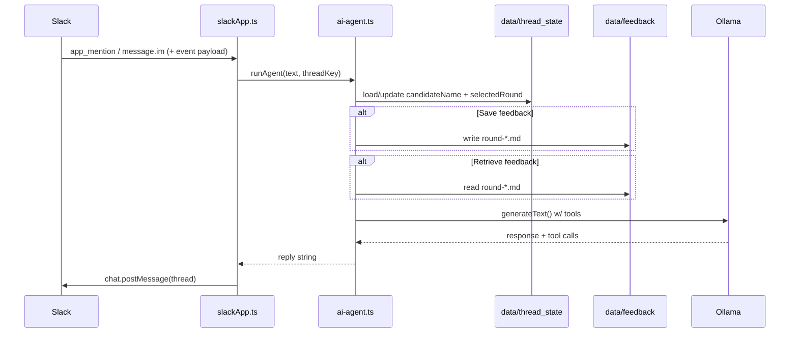

# Interview Feedback Agent

A Slack bot that helps recruiters and interviewers **store**, **retrieve**, and **summarize** interview feedback using an LLM (Ollama local or [Ollama Cloud](https://ollama.com)), with optional **web search** when memory is not enough.

---

## TypeScript (production-ready) implementation

This repo now includes a **TypeScript + Vercel AI SDK** implementation that:

- Stores feedback on the **local filesystem** as structured markdown in `data/feedback/`
- Supports **multiple rounds** per candidate
- Maintains **conversation state per Slack thread** in `data/thread_state/` (candidate + selected round)
- Uses **Vercel AI SDK tool-calling** with an **Ollama** model

### Storage layout

`data/feedback/{candidate-slug}/{candidate-slug}_{interviewer-slug}_round-{roundNumber}-{roundType}.md`

Example:

- `john-doe_alice_round-1-dsa.md`
- `john-doe_bob_round-2-hld.md`

### Markdown format (strict)

Each file is written with:

- `# Candidate: {name}`
- `# Round: {round}`
- `# Interviewer: {name}`
- `# Date: {ISO}`
- `## Summary`
- `## Strengths`
- `## Weaknesses`
- `## Verdict`
- `---`

### Run locally (TypeScript)

```bash
cd interview_feedback_agent
npm install
cp .env.example .env   # fill in SLACK_* and OLLAMA_*
npm run dev
```

Slack setup:

- **Socket Mode** (easiest local dev): set `SLACK_APP_TOKEN` + `SLACK_BOT_TOKEN`
- **HTTP mode**: set `SLACK_SIGNING_SECRET` + expose `http://localhost:3000/slack/events` via a public HTTPS URL

Interaction:

- Mention the bot: `@YourBot save feedback John round 1 dsa ...`
- DM the bot
- Or use the slash command: `/feedback get feedback John`

### Example prompts (TypeScript agent)

- Save: `save feedback John Doe round 1 dsa interviewer Alice: Solid on arrays; struggled with DP; verdict: Hold`
- Retrieve (ambiguous): `get feedback John Doe` → the agent will list rounds and ask which one
- Retrieve (specific): `get feedback John Doe round 1`
- Follow-ups: `What questions should I ask this candidate?` (agent will ask for candidate/round if missing, then use web search)

---

## High-level architecture

```mermaid
flowchart LR
    subgraph slack [Slack workspace]
        U[User]
    end

    subgraph runtime [Node.js + TypeScript]
        SB[src/slack/slackApp.ts\nBolt + Socket or HTTP]
        AG[src/agent/agent.ts\nVercel AI SDK Agent]
        ST[(data/thread_state\nper-thread JSON state)]
        FS[(data/feedback\nmarkdown files)]
        TO[src/tools/*\nweb_search + feedback tools]
    end

    subgraph external [External services]
        OLL[Ollama API\n/api]
        DDG[DuckDuckGo\nInstant Answer API]
        TAV[Tavily (optional)]
    end

    U <-->|Events + chat.postMessage| SB
    SB --> AG
    AG --> ST
    AG --> FS
    AG --> TO
    TO --> DDG
    TO --> TAV
    AG --> OLL
```

Entry point: Slack → `src/slack/slackApp.ts` → `src/agent/agent.ts` (Vercel AI SDK + tools) → local filesystem.

---

## Runtime modes (Slack delivery)

| Mode | Env | How events arrive |
|------|-----|-------------------|
| **Socket Mode** (default for local dev) | `SLACK_APP_TOKEN` (`xapp-…`) | WebSocket to Slack; no public URL. |
| **HTTP / Events API** | No app token; `SLACK_SIGNING_SECRET` + `PORT` | Bolt listens on `http://host:PORT/slack/events`; Slack POSTs to a **public HTTPS** URL (e.g. ngrok). |

Both paths deliver the same event payloads to Bolt; your handlers do not change.

---

## Request flow (Slack → reply)



1. **Inbound:** Bolt listens for `app_mention` (channels) and `message` in DMs.
2. **State:** Per-thread state is persisted to disk (`data/thread_state/`) so the agent can ask clarifying questions and remember the chosen round.
3. **Outbound:** Reply is sent with `chat.postMessage` in the same thread / DM.

---

## External APIs (summary)

| Service | Purpose | Config |
|--------|---------|--------|
| **Slack** | Events in, messages out | `SLACK_BOT_TOKEN`, Socket: `SLACK_APP_TOKEN`, HTTP: `SLACK_SIGNING_SECRET`, `PORT` |
| **Ollama** | Chat completions + tool calling | `OLLAMA_BASE_URL`, `OLLAMA_MODEL`, optional `OLLAMA_API_KEY` |
| **Tavily** (optional) | Web search | `TAVILY_API_KEY` |
| **DuckDuckGo** | Optional instant answers for web search | None (HTTP GET from `api.duckduckgo.com`) |

Ollama is called via the provider at **`{OLLAMA_BASE_URL}/api`**.

---

## Configuration

## Project layout

| File | Role |
|------|------|
| `src/slack/slackApp.ts` | Slack Bolt app, Socket/HTTP, `/feedback` command |
| `src/agent/agent.ts` | Vercel AI SDK agent + tool calling + thread state |
| `src/storage/feedbackStore.ts` | Markdown file persistence under `data/feedback/` |
| `src/state/threadState.ts` | Per-thread JSON state under `data/thread_state/` |
| `src/tools/*` | Tools: `save_feedback`, `get_feedback`, `list_rounds`, `web_search` |

---

## Operational limitations

- **Local filesystem** — markdown files are local; if you run multiple instances, you’ll need shared storage.
- **Slack scopes:** Reading threads in public/private channels may require `channels:history` / `groups:history` in addition to `im:history` for DMs.
